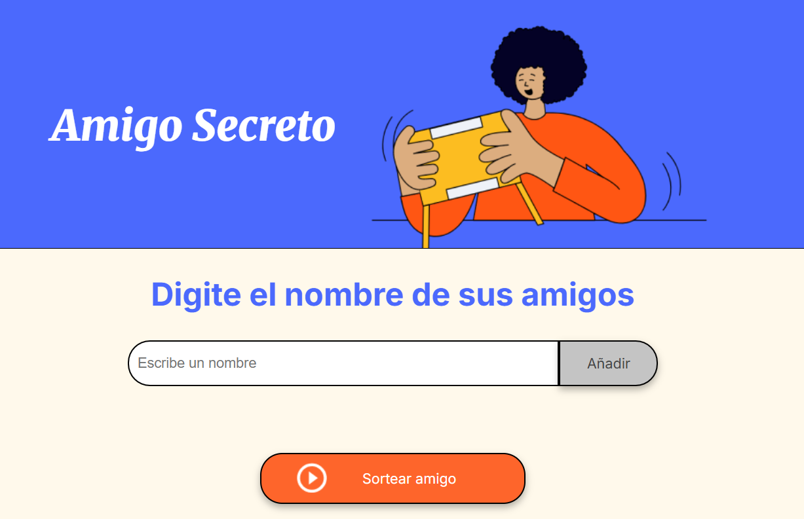
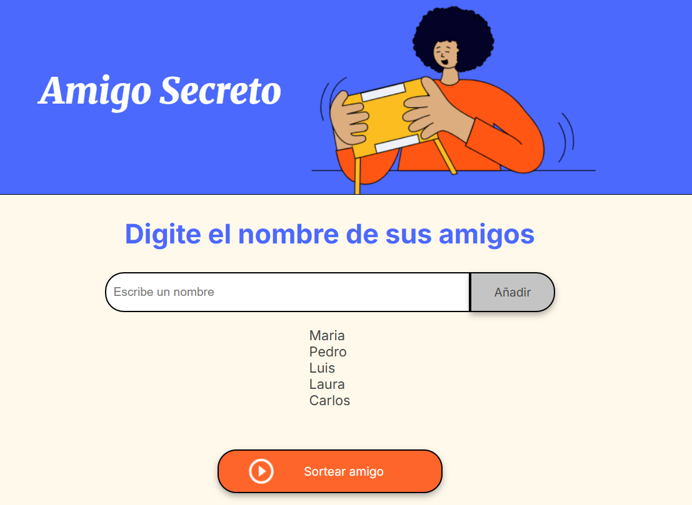
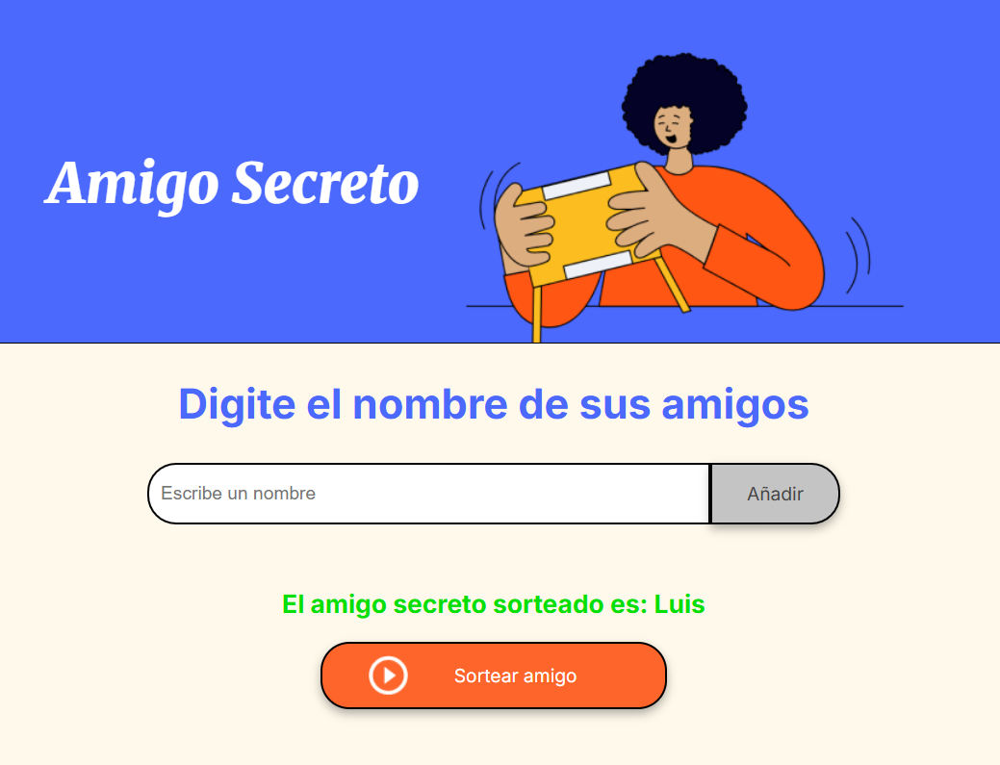

# 🎁 Amigo Secreto

Este es un proyecto desarrollado como parte de un desafío para el Programa ONE de Alura Latam y Oracle.

## 🧩 Descripción del proyecto

Esta aplicación permite a los usuarios ingresar nombres de amigos en una lista para luego realizar un sorteo aleatorio y determinar quién es el "amigo secreto".

## 🚀 Funcionalidades principales

- **Agregar nombres**: Los usuarios pueden escribir un nombre en un campo de texto y hacer clic en el botón "Adicionar" para agregarlo a la lista.

- **Validación de entrada**: Si el campo está vacío, se muestra una alerta indicando que debe ingresarse un nombre válido.

- **Visualización de la lista**: Los nombres ingresados se muestran en pantalla, debajo del campo de entrada.

- **Sorteo aleatorio**: Al hacer clic en el botón "Sortear Amigo", se elige un nombre al azar de la lista y se muestra el resultado en pantalla.

## 🛠️ Tecnologías utilizadas

- HTML
- CSS
- JavaScript

### ¡Gracias por visitar el repositorio! 🎉

